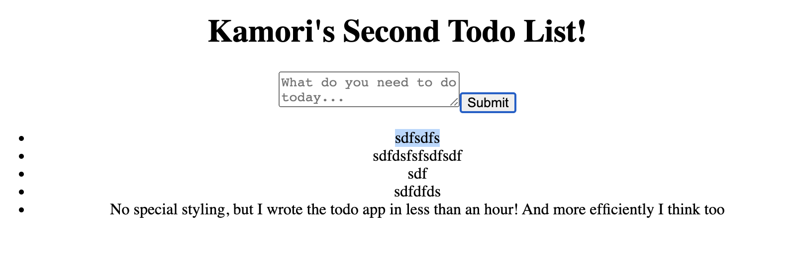

Kamori's Second Todo app in an hour
====

I started going over the Reactjs Main Concepts, notably these articles.

* https://reactjs.org/docs/components-and-props.html
* https://reactjs.org/docs/state-and-lifecycle.html
* https://reactjs.org/docs/handling-events.html

And I wanted to give this todo app another shot to see if I can write it moar better.

Big improvement in speed and understanding over last time. And I wrote it in 47 minutes this time.

----
Boostrapped with create-react-app

Run `npm start`